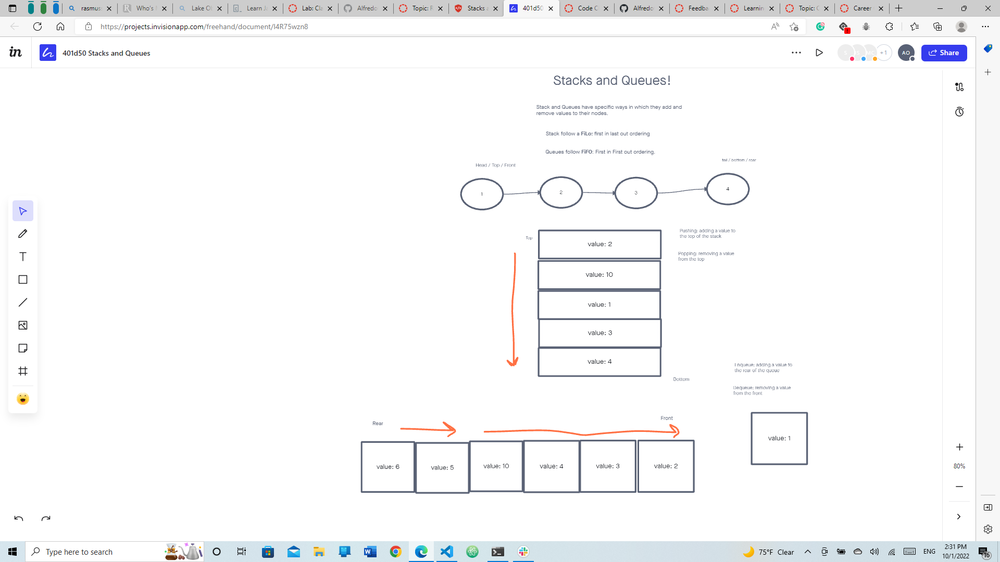

# stack-queue-pseudo

## Challenge

### Create a new class called pseudo queue.

Do not use an existing Queue.
Instead, this PseudoQueue class will implement our standard queue interface (the two methods listed below),
Internally, utilize 2 Stack instances to create and manage the queue

### Methods:

- enqueue
Arguments: value
Inserts a value into the PseudoQueue, using a first-in, first-out approach.

- dequeue
Arguments: none
Extracts a value from the PseudoQueue, using a first-in, first-out approach.

## Structure and Testing

Utilize the Single-responsibility principle: any methods you write should be clean, reusable, abstract component parts to the whole challenge. You will be given feedback and marked down if you attempt to define a large, complex algorithm in one function definition.

You have access to the Node class and all the properties on the Stack and Queue classes.

## Whiteboard Process

<!-- Embedded whiteboard image -->

## Approach & Efficiency

<!-- What approach did you take? Discuss Why. What is the Big O space/time for this approach? -->

Run [npm test code-challenge11] to run tests.
