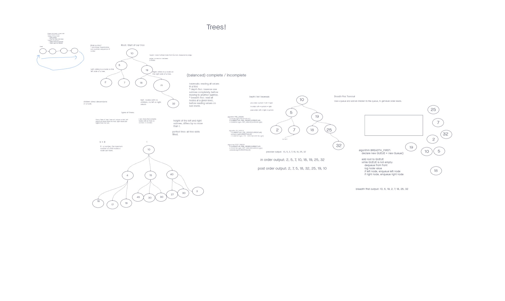

# trees-breadth-first

## Challenge

Write a function called breadth first
Arguments: tree
Return: list of all values in the tree, in the order they were encountered

## Structure and Testing

Run [npm test code-challenge17] to run tests.

## Whiteboard Process

<!-- Embedded whiteboard image -->

## Approach & Efficiency

<!-- What approach did you take? Discuss Why. What is the Big O space/time for this approach? -->

Time = O(logn) 
Space = O(1)
