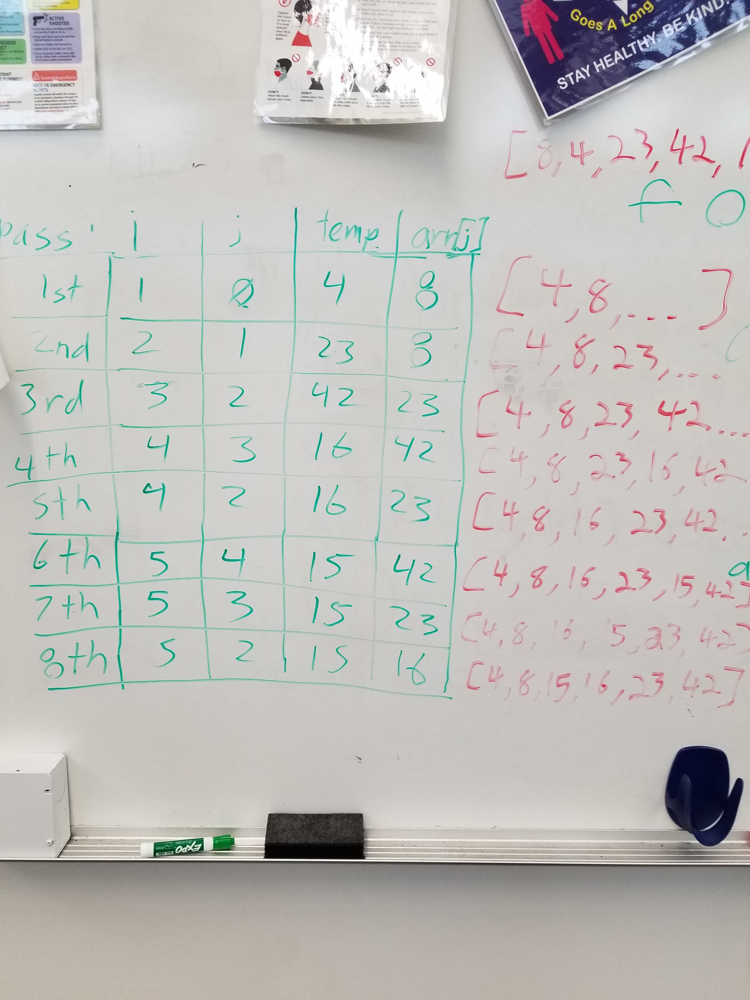

# insertion-sort

## Challenge

Write a function called insertionSort 
Arguments: array 
Return: array 
returns the original array with all values numerically sorted in order.

## Structure and Testing

Utilize the Single-responsibility principle: any methods you write should be clean, reusable, abstract component parts to the whole challenge. You will be given feedback and marked down if you attempt to define a large, complex algorithm in one function definition.
 
Run [npm test code-challenge26] to run tests.

## Whiteboard Process

<!-- Embedded whiteboard image -->

## Approach & Efficiency

<!-- What approach did you take? Discuss Why. What is the Big O space/time for this approach? -->

Time = O(n^2) 
Space = O(1)
