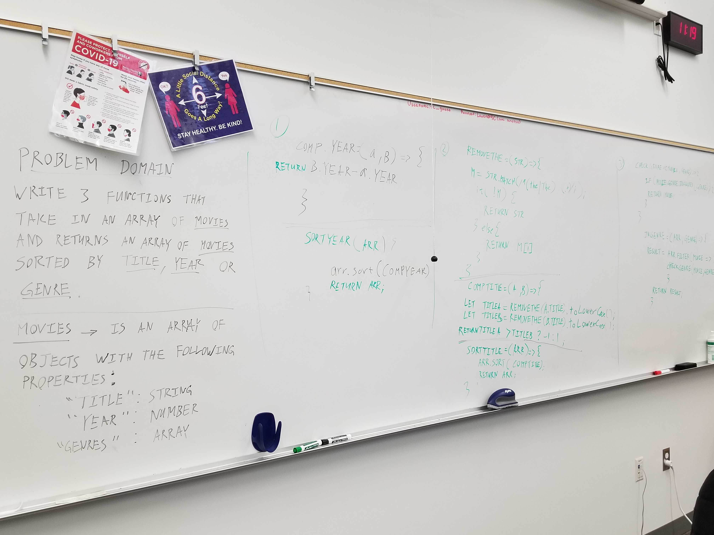

# movie-sort

## Challenge

- Implement the functions `sortYear`, `sortTitle`, and `inGenre` in the file `sort.ts`.

  - Execute your tests while developing using `npm run watch`
  - Execute your tests in CI using `npm test`

- Functions:
  - sortYear
    - Arguments: `movies` array
    - Sorts the input array by year, in ascending order.
  - sortTitle
    - Arguments: `movies` array
    - Sorts the input array by title, ignoring `"The "` at the beginning of titles.
  - inGenre
    - Arguments: `movies` array, `genre` string
    - Filters the input array, returning only those movies who include `genre`.

- Extract the comparator callbacks
  - sortYear and sortTitle should both be implemented by passing a custom comparison function to the built-in sort utility.
  - Export these helper functions at the top level of your file, and call them from your sortYear and sortTitle functions.
  - Import these helper functions into your test, and write tests that verify they return the appropriate comparison values (<0, 0, or >0).

## Structure and Testing

Utilize the Single-responsibility principle: any methods you write should be clean, reusable, abstract component parts to the whole challenge. You will be given feedback and marked down if you attempt to define a large, complex algorithm in one function definition.
 
Run [npm test code-challenge28] to run tests.

## Whiteboard Process

<!-- Embedded whiteboard image -->

## Approach & Efficiency

<!-- What approach did you take? Discuss Why. What is the Big O space/time for this approach? -->

Time = O(n) 
Space = O(1)
