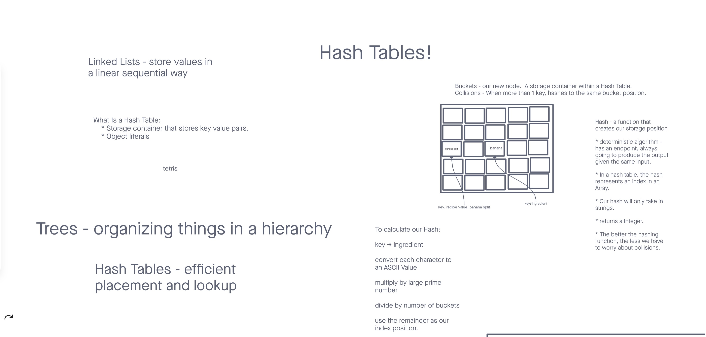

# hashmap-repeated-word

## Challenge

Find the first repeated word in a book.

- Write a function called repeated word that finds the first word to occur more than once in a string
  - Arguments: string
  - Return: string

## Structure and Testing

- Setting a key/value to your hashtable results in the value being in the data structure
- Retrieving based on a key returns the value stored
- Successfully returns null for a key that does not exist in the hashtable
- Successfully returns a list of all unique keys that exist in the hashtable
- Successfully handle a collision within the hashtable
- Successfully retrieve a value from a bucket within the hashtable that has a collision
- Successfully hash a key to an in-range value
 
Run [npm test code-challenge31] to run tests.

## Whiteboard Process

<!-- Embedded whiteboard image -->

## Approach & Efficiency

<!-- What approach did you take? Discuss Why. What is the Big O space/time for this approach? -->

Time = O(n) 
Space = O(n)
