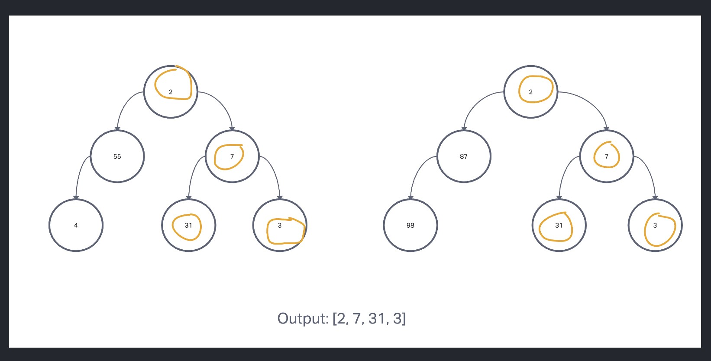

# tree-intersection

## Challenge

- Write a function called tree_intersection that takes two binary trees as parameters.
- Using your Hashmap implementation as a part of your algorithm, return a set of values found in both trees.

## Structure and Testing

- Should find intersection of two trees
 
Run [npm test code-challenge32] to run tests.

## Whiteboard Process

<!-- Embedded whiteboard image -->

## Approach & Efficiency

<!-- What approach did you take? Discuss Why. What is the Big O space/time for this approach? -->

Time = O(n) 
Space = O(1)
