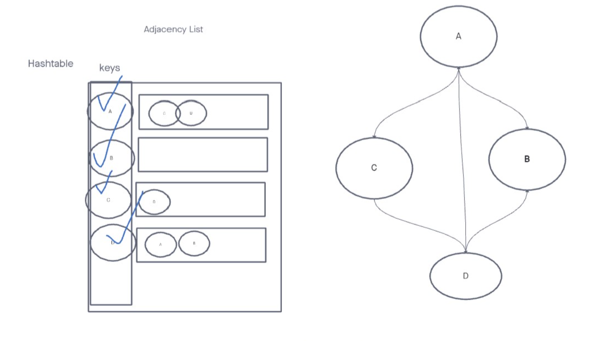
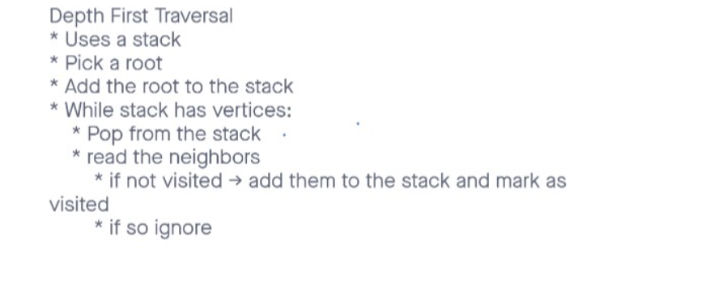

# graph-depth-first

## Challenge

Write the following method for the Graph class:

depth first
- Arguments: Node
- Return: A collection of nodes in the order they were visited.
- Display the collection

## Structure and Testing
 
Run [npm test code-challenge38] to run tests.

## Whiteboard Process

<!-- Embedded whiteboard image -->

## Approach & Efficiency

<!-- What approach did you take? Discuss Why. What is the Big O space/time for this approach? -->

Time = O(n) 
Space = O(1)
